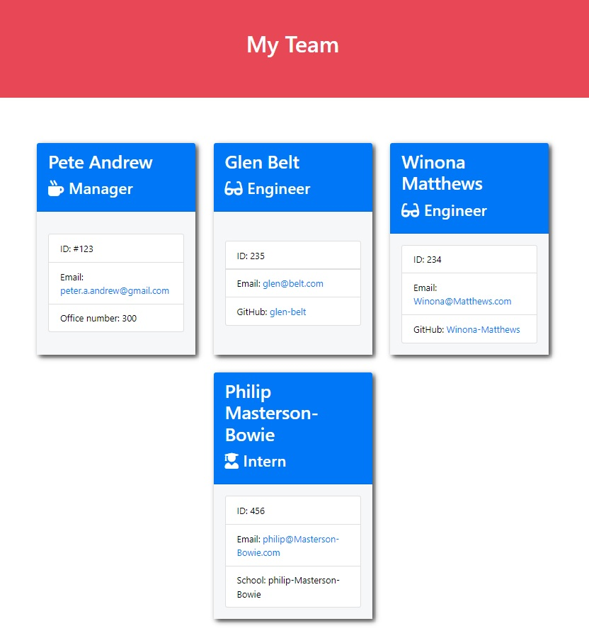

# Team Profile Generator

## Description: 
The aim of this task was to produce an application that used node.js commands to collect employee information that was then rendered to a html document. 

## Table of Contents: 

* [Description](#description)
* [Installation](#installation)
* [Usage](#usage)
* [licence](#licence)
* [Contributing](#contributing)
* [Tests](#tests)
* [Questions](#questions)

## Installation: 

This application also requires node.js, file system and the inquirer module (need to run: npm i inquirer@6.5.0). This app uses Jest to run it's testing.

run:  
npm install   
npm i inquirer@6.5.0  
npm i jest --save-dev 

## Usage: 
Screen shot with example data:   

This appilcation requires you to use node.js in the integrated terminal in VS code.

## Licence: 
This product is licenced under the MIT licence.
## Contributing: 
n/a
## Tests: 

Uses jest. Run 'npm test' in the integrated terminal. 

## Questions: 
If you would like to learn more about this project or my programming please see the following GitHub:  

https://github.com/Pete-Andrew 

If you would like to contact me please use the following email address: 

peter.a.andrew@gmail.com 

Thanks and happy coding! 